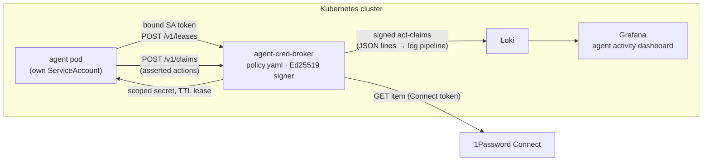

# agent-cred-broker

A credential broker and action-audit layer for autonomous AI agents running on a
single Kubernetes cluster. Agents stop holding long-lived secrets. They authenticate
with their workload identity and receive scoped, short-TTL credentials, and every
issuance and every agent-reported action lands in Loki as a signed audit event — an
"act-claim".

**Status: broker implemented, deployment next.** The [threat model](docs/threat-model.md)
and [API spec](docs/api.md) were written first; the broker (`cmd/broker`) and the
offline audit verifier (`cmd/acb-verify`) now implement them. The Helm chart, the
GitOps deployment, and the first converted real workload are next. This README gets
corrected wherever reality diverges.

## Why this exists

I have run autonomous Claude-based agents against my production k3s homelab for
months — a nightly agent that reviews dependency-update PRs and merges the low-risk
ones, plus agents that diagnose and fix scraper failures. They work. Their
credential story did not:

- Each agent pod held a **vault-wide secrets-manager token in its environment**,
  permanently. Any process in the pod could read *every* secret in the vault.
- The tokens were **long-lived by necessity** — short-lived ones expired mid-schedule
  and broke the agents, so the durable fix was to make the credentials less safe.
- In the vault's audit log, **every agent looked identical** (same service account).
  Nothing recorded which agent used which credential, when, or what it claimed to be
  doing at the time.

That last point is the uncomfortable one. An autonomous agent with `--yolo`-grade
tool permissions and a merge button is exactly the workload you want a flight
recorder for, and the standard setup provides none.

This broker is the fix I wanted to exist, built as a public portfolio project: the
problem is real (it is being built against my own cluster, to convert my own
agents), and the design writing is the deliverable as much as the code.

## What it does

- **Per-agent identity, no provisioned secrets.** Agents authenticate with bound
  Kubernetes ServiceAccount tokens (audience-scoped, kubelet-rotated); the broker
  verifies them via TokenReview. No agent API key is ever provisioned or managed;
  a leaked token is worth minutes of broker-only access, not a permanent vault.
  ([ADR-0002](docs/adr/0002-identity-serviceaccount-tokenreview.md))
- **Scoped, TTL-boxed issuance fronting 1Password Connect.** A deny-by-default
  policy maps each agent to the scopes it may lease, with TTL caps and issuance
  windows ("this PAT is obtainable for 45 minutes a day, around the nightly run").
  The only long-lived credential left resident in any pod is the broker's own
  Connect token, in one hardened pod that runs no agent code — the brokered secrets
  themselves stay long-lived at their providers (see the threat model).
- **Revocable credentials where the provider can mint them.** For GitHub, the broker
  mints **GitHub App installation tokens** — scoped to policy-pinned repos and
  permissions, hard-expiring in ~1h — instead of leasing a static PAT. These carry
  `"semantics": "revocable"` and the lease is clamped to the token's real expiry, so a
  leak dies on its own within the hour rather than waiting on a rotation runbook. This
  is the "eliminate, not just contain" path; the same interface admits Kubernetes
  TokenRequest and cloud STS next. ([ADR-0005](docs/adr/0005-dynamic-revocable-providers.md))
- **Signed act-claims.** Every lease decision (including denials) and every
  agent-submitted claim ("merging PR #4123, risk=LOW") is emitted as an
  Ed25519-signed JSON event, shipped to Loki by the log pipeline the cluster already
  runs, verifiable offline. Broker-attested facts and agent-asserted context are
  structurally separate fields, because one of them can lie.
  ([ADR-0003](docs/adr/0003-audit-signed-stdout-loki.md))
- **A "what did my agents do today" Grafana dashboard** over the act-claim stream.

## Limits

The [threat model](docs/threat-model.md) leads with non-goals, and
[ADR-0004](docs/adr/0004-static-secret-lease-semantics.md) encodes the biggest one
into the API: leases over static secrets are **disclosure records, not revocation**.
Every lease over a static secret says `"semantics": "static-disclosure"` so nobody
mistakes bookkeeping for containment. TTL enforcement is real at issuance time;
after disclosure, the value of the lease is attribution and anomaly detection.
Prompt injection, lying agents, compromised platforms: covered there too, under
"does not defend against."

## Architecture



The broker is ~one binary: TokenReview for authn, a YAML policy for authz, the
1Password Connect REST API as the secret source, stdout as the audit transport.
Boring on purpose; the design decisions and their trade-offs are in
[docs/adr/](docs/adr/).

### What an act-claim looks like

```json
{
  "type": "lease.issued",
  "ts": "2026-07-03T12:00:02Z",
  "subject": { "namespace": "agents", "serviceaccount": "pr-reviewer", "pod": "pr-reviewer-29184760-x7k2m" },
  "attested": { "scope": "github-bot-pat", "lease_id": "lease_01HZXW9K...", "ttl_seconds": 900,
                "policy_hash": "sha256:9f2c...", "decision": "issued" },
  "asserted": { "run_id": "nightly-2026-07-03", "reason": "review dependency-update PRs" },
  "broker": { "kid": "2026-07-a", "seq": 4127 },
  "sig": "<base64 Ed25519 signature>"
}
```

`attested` is what the broker observed; `asserted` is what the agent said; the
signature proves who recorded it and when, not that it is true. Full schema in the
[API spec](docs/api.md).

## What it deliberately is not

- **Not a product.** No multi-tenancy, no HA, no pricing page. Single cluster,
  single operator, a handful of agents.
- **Not a Vault/OpenBao replacement.** If you need dynamic secrets engines and
  revocation at scale, run those. This exists because operating Vault to serve three
  agents on a homelab is disproportionate — and because the agent-shaped audit layer
  (act-claims tied to workload identity) is the part I couldn't get off the shelf.
- **Not an agent framework.** It doesn't run, sandbox, or supervise agents; it
  controls what credentials they can obtain and records what happens.

## Roadmap

| Step | Deliverable | State |
|------|-------------|-------|
| 1 | Threat model + API spec | done |
| 2a | Broker MVP (Go) + offline audit verifier, tested | done |
| 2b | Helm chart, deployed via GitOps | next |
| 3 | First real workload converted: the nightly PR-review agent leases its GitHub and model-provider credentials instead of holding them | planned |
| 3b | Revocable dynamic provider: GitHub App installation tokens (broker mints ~1h repo-and-permission-scoped tokens; `revocable` semantics, lease clamped to token expiry) | broker done, App wiring next |
| 4 | Grafana dashboard + demo GIF + quickstart | planned |
| — | Active revocation on surrender (`DELETE /installation/token`), more dynamic providers (Kubernetes TokenRequest, cloud STS), signing-key rotation, off-cluster audit archival, claim-vs-provider-log verification | future, unpromised |

## Development

Go 1.23, three pinned dependencies (YAML, RFC 8785 canonicalization, cron parsing
— see [ADR-0001](docs/adr/0001-go-minimal-deps.md)).

```sh
make build   # bin/broker, bin/acb-verify
make test
make lint    # gofmt + go vet
```

Local run without a cluster (plaintext + ephemeral signing key, never in
production):

```sh
ACB_DEV_INSECURE=1 ACB_POLICY_FILE=policy.yaml \
  ACB_CONNECT_URL=http://localhost:8080 ACB_KUBE_API=http://localhost:8001 \
  ./bin/broker
```

## Docs

- [Threat model](docs/threat-model.md) — assets, actors, mitigations, and an explicit
  list of what this does not defend against
- [API spec](docs/api.md) — endpoints, audit event schema, policy format
- [ADRs](docs/adr/) — Go and minimal deps · ServiceAccount identity · signed-stdout
  audit · static-secret lease semantics · revocable dynamic providers (GitHub App)

## License

[MIT](LICENSE)
